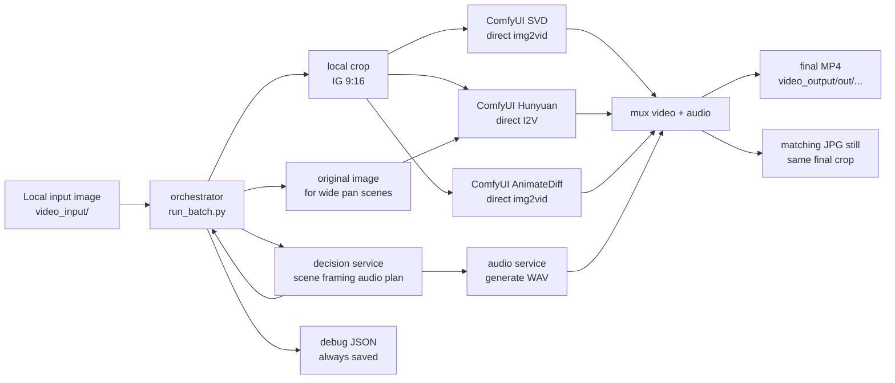

# Image-to-Video Local Pipeline

Local-only image-to-video pipeline (no AWS/S3/AMI/infra flow).

## Services

- `services/decision`:
  - Sends image + prompt to OpenAI and returns structured decision JSON:
    - scene (`tags`, `has_people`, `confidence`)
    - framing (`target_aspect`, `crop_anchor`)
    - video preset/fallbacks
    - audio prompt/mix
- `services/comfy`:
  - Runs ComfyUI and executes render workflows.
  - Uses workflow templates in `services/comfy/workflow_templates/`.
  - Outputs rendered media to `/data/outputs/comfy`.
  - Current batch mode renders the selected primary preset plus the first fallback from a different backend family.
- `services/audio`:
  - FastAPI service for audio generation.
  - Backends:
    - `tangoflux` (default model generation)
    - `audioldm` (legacy model generation)
    - `mock` / `mock-fallback` (simple synthetic tone/noise fallback)
  - AudioLDM path generates multiple candidates, selects the best via RMS/clipping score,
    then applies ffmpeg post-processing (`loudnorm`, limiter, bass, stereo widen, reverb, fade).
  - Final output wav is post-processed to `48kHz` stereo.
  - Outputs wav files to `/data/outputs/audio`.
- `services/orchestrator`:
  - Main batch runner (`run_batch.py`).
  - Loads local images, calls decision service, prepares an IG 9:16 crop,
    renders selected variants with Comfy, generates audio, muxes final mp4s, exports matching JPG stills, writes `debug.json`.
  - Wide Hunyuan pan scenes can use the original image and `video.params.output_aspect=square_1_1`
    when a vertical Reel crop would be too zoomed. The matching JPG still is extracted from the final cropped video.

## Flow



## Prerequisites

- Docker + Docker Compose plugin
- NVIDIA driver + Docker GPU runtime (for GPU render/audio)
- Local folders:
  - input images: `video_input/`
  - outputs: `video_output/`
  - models: `.local/models/`
  - render output/cache: `.local/outputs/`
  - audio cache: `.local/audio-cache/`

## Model Preparation

Create model folders:

```bash
mkdir -p "${MODEL_DIR:-$PWD/.local/models}"/{checkpoints,diffusion_models,text_encoders,vae,clip_vision,animatediff_models}
```

Download required checkpoints:

```bash
curl -L "https://huggingface.co/stabilityai/stable-video-diffusion-img2vid-xt/resolve/main/svd_xt.safetensors?download=true" \
  -o "${MODEL_DIR:-$PWD/.local/models}/checkpoints/svd_xt.safetensors"

curl -L "https://huggingface.co/Comfy-Org/stable-diffusion-v1-5-archive/resolve/main/v1-5-pruned-emaonly-fp16.safetensors?download=true" \
  -o "${MODEL_DIR:-$PWD/.local/models}/checkpoints/v1-5-pruned-emaonly-fp16.safetensors"
```

Anime SD 1.5 checkpoints used by AnimateDiff profile defaults:

```bash
curl -L "https://huggingface.co/Xiero/Meinamix/resolve/e19075878a33073d3f5e6e16e19f82ab7056719f/meinamix_meinaV11.safetensors?download=true" \
  -o "${MODEL_DIR:-$PWD/.local/models}/checkpoints/meinamix_v11.safetensors"

curl -L "https://huggingface.co/gsdf/Counterfeit-V3.0/resolve/main/Counterfeit-V3.0_fp16.safetensors?download=true" \
  -o "${MODEL_DIR:-$PWD/.local/models}/checkpoints/counterfeit_v30.safetensors"
```

AnimateDiff motion model:

```bash
curl -L "https://huggingface.co/guoyww/animatediff/resolve/main/mm_sd_v15_v2.ckpt?download=true" \
  -o "${MODEL_DIR:-$PWD/.local/models}/animatediff_models/mm_sd_v15_v2.ckpt"
```

Modern HunyuanVideo 1.5 I2V models for the RTX 3090 presets:

```bash
curl -L "https://huggingface.co/Comfy-Org/HunyuanVideo_1.5_repackaged/resolve/main/split_files/diffusion_models/hunyuanvideo1.5_720p_i2v_fp16.safetensors?download=true" \
  -o "${MODEL_DIR:-$PWD/.local/models}/diffusion_models/hunyuanvideo1.5_720p_i2v_fp16.safetensors"

curl -L "https://huggingface.co/Comfy-Org/HunyuanVideo_1.5_repackaged/resolve/main/split_files/text_encoders/qwen_2.5_vl_7b_fp8_scaled.safetensors?download=true" \
  -o "${MODEL_DIR:-$PWD/.local/models}/text_encoders/qwen_2.5_vl_7b_fp8_scaled.safetensors"

curl -L "https://huggingface.co/Comfy-Org/HunyuanVideo_1.5_repackaged/resolve/main/split_files/text_encoders/byt5_small_glyphxl_fp16.safetensors?download=true" \
  -o "${MODEL_DIR:-$PWD/.local/models}/text_encoders/byt5_small_glyphxl_fp16.safetensors"

curl -L "https://huggingface.co/Comfy-Org/sigclip_vision_384/resolve/main/sigclip_vision_patch14_384.safetensors?download=true" \
  -o "${MODEL_DIR:-$PWD/.local/models}/clip_vision/sigclip_vision_patch14_384.safetensors"

curl -L "https://huggingface.co/Comfy-Org/HunyuanVideo_1.5_repackaged/resolve/main/split_files/vae/hunyuanvideo15_vae_fp16.safetensors?download=true" \
  -o "${MODEL_DIR:-$PWD/.local/models}/vae/hunyuanvideo15_vae_fp16.safetensors"
```

Verify:

```bash
ls -lh "${MODEL_DIR:-$PWD/.local/models}/checkpoints"
```

Current model selection:

- `HUNYUAN15_I2V_720P` / `HUNYUAN15_I2V_FAST` run direct HunyuanVideo 1.5 image-to-video.
- `SVD_SUBTLE` / `SVD_STRONG` run direct SVD img2vid from the cropped input.
- `ANIMATEDIFF_GRASS_WIND` / `ANIMATEDIFF_CITY_PULSE` run direct AnimateDiff img2vid from the cropped input.
- Core SVD video model: `svd_xt.safetensors`
- Core AnimateDiff motion model: `mm_sd_v15_v2.ckpt`
- AnimateDiff presets use:
  - `meinamix_v11.safetensors`
  - `counterfeit_v30.safetensors`
- The separate animated still redraw step and low-memory presets are removed from the active pipeline.

Reference docs:
- HunyuanVideo 1.5 ComfyUI workflow and model paths: https://docs.comfy.org/tutorials/video/hunyuan/hunyuan-video-1-5
- AnimateDiff motion model: https://huggingface.co/guoyww/animatediff

## Environment Variables

Set these in `.env`:

- `LOCAL_INPUT_DIR`: host path mounted to `/data/local_inputs`
- `LOCAL_OUTPUT_DIR`: host path mounted to `/data/local_outputs`
- `MODEL_DIR`: host path mounted to `/opt/ComfyUI/models`
- `OUTPUT_DIR`: host path mounted to `/data/outputs`
- `AUDIO_CACHE_DIR`: host path mounted to `/cache`
- `AUDIO_HOST_PORT`: local forwarded audio port (example `8001`)
- `OPENAI_API_KEY`: decision API key
- `OPENAI_MODEL`: decision model (example `gpt-5.4-mini`)
- `AUDIO_MODEL_BACKEND`: `tangoflux`, `audioldm`, or `mock`
- `AUDIO_DEVICE`: `cuda` or `cpu`
- `AUDIO_INFERENCE_STEPS`: AudioLDM inference steps (default `60`)
- `AUDIO_GUIDANCE_SCALE`: AudioLDM guidance scale (default `3.5`)
- `AUDIO_NUM_SAMPLES`: candidates generated per prompt (default `3`)
- `TANGOFLUX_MODEL`: TangoFlux model id (default `declare-lab/TangoFlux`)
- `TANGOFLUX_STEPS`: TangoFlux inference steps (default `50`)
- `TANGOFLUX_GUIDANCE_SCALE`: TangoFlux guidance scale (default `4.5`)
- `HF_HUB_DISABLE_XET`: disable Hugging Face Xet transfer when model download stalls (default `1`)
- `AUDIO_REQUEST_TIMEOUT_S`: orchestrator audio request timeout, useful for TangoFlux cold loads (default `900`)
- `AUDIO_SEED_BASE`: deterministic seed base (default `42`)
- `AUDIO_TARGET_LUFS`: loudness target for `loudnorm` (default `-14`)
- `AUDIO_TRUE_PEAK_DB`: true-peak ceiling in dB (default `-1.0`)
- `AUDIO_BASS_GAIN_DB`: bass enhancement gain (default `0`)
- `AUDIO_STEREO_MLEV`: stereo widening amount (default `0`)
- `AUDIO_REVERB_DELAY_MS`: reverb delay in ms (default `700`)
- `AUDIO_REVERB_DECAY`: reverb decay (default `0.08`)
- `AUDIO_MUX_GAIN_DB`: gain added at final mux stage (default `3.0`)
- `AUDIO_MUX_TARGET_LUFS`: mux-stage loudnorm target (default `-12.0`)
- `AUDIO_MUX_TRUE_PEAK_DB`: mux-stage true peak ceiling (default `-1.0`)
- `COMFY_PROMPT_TIMEOUT_S`: max wait for one Comfy prompt before orchestrator fails (default `3600`)

Use the variable names above directly. Older aliases such as `DECISION_OPENAI_MODEL`,
`PIPELINE_AUDIO_MODEL_BACKEND`, and `ANIMATEDIFF_MODEL_DIR` are not used by compose.

Container runtime env is set in compose:
- `COMFY_URL=http://comfyui:8188`
- `AUDIO_URL=http://audio:8000`
- `INPUT_DIR=/data/inputs`
- `OUTPUT_DIR=/data/outputs`

## Start Stack

```bash
docker compose --env-file $(pwd)/.env \
  -f services/comfy/docker-compose.yml \
  -f services/comfy/docker-compose.gpu.yml \
  up -d --build
```

The Comfy image pins official PyTorch CUDA 13 wheels (`torch==2.10.0+cu130`) so Hunyuan can use the optimized CUDA operations requested by ComfyUI. The GPU compose profile still starts Comfy with `--lowvram`; on RTX 3090 this avoids HunyuanVideo 1.5 restarts after sampling while keeping the 720P preset usable.

If the running Comfy container was built before this change, rebuild and recreate it:

```bash
docker compose --env-file $(pwd)/.env \
  -f services/comfy/docker-compose.yml \
  -f services/comfy/docker-compose.gpu.yml \
  build --no-cache comfyui

docker compose --env-file $(pwd)/.env \
  -f services/comfy/docker-compose.yml \
  -f services/comfy/docker-compose.gpu.yml \
  up -d --force-recreate comfyui
```

Verify the container is using CUDA 13 PyTorch:

```bash
docker exec pipeline-comfyui python -c "import torch; print(torch.__version__, torch.version.cuda)"
```

Expected output starts with `2.10.0+cu130 13.0`.

If models changed, restart Comfy:

```bash
docker compose --env-file $(pwd)/.env \
  -f services/comfy/docker-compose.yml \
  -f services/comfy/docker-compose.gpu.yml \
  restart comfyui
```

If `.env` changed for audio backend/device, recreate audio (restart is not enough):

```bash
docker compose --env-file $(pwd)/.env \
  -f services/comfy/docker-compose.yml \
  -f services/comfy/docker-compose.gpu.yml \
  up -d --force-recreate audio
```

## Run Batch

```bash
docker compose --env-file $(pwd)/.env \
  -f services/comfy/docker-compose.yml \
  -f services/comfy/docker-compose.gpu.yml \
  exec -T orchestrator python /app/services/orchestrator/run_batch.py \
  --job-id dry-001 \
  --input-prefix . \
  --output-prefix out \
  --local-input-dir /data/local_inputs \
  --local-output-dir /data/local_outputs
```

Run exactly one file:

```bash
docker compose --env-file $(pwd)/.env \
  -f services/comfy/docker-compose.yml \
  -f services/comfy/docker-compose.gpu.yml \
  exec -T orchestrator python /app/services/orchestrator/run_batch.py \
  --job-id dry-001 \
  --input-file _MG_6609.jpg \
  --output-prefix out \
  --local-input-dir /data/local_inputs \
  --local-output-dir /data/local_outputs
```

## Defaults

Applied automatically when no explicit override is provided:

```json
{"render_variants":"selected_pair"}
```

`seed` is auto-generated per run unless you pass it explicitly.

Available video presets:
- `HUNYUAN15_I2V_720P`
- `HUNYUAN15_I2V_FAST`
- `SVD_SUBTLE`
- `SVD_STRONG`
- `ANIMATEDIFF_GRASS_WIND`
- `ANIMATEDIFF_CITY_PULSE`

Preset behavior:
- Hunyuan presets animate the cropped input by default, or the original full image when wide-pan preservation is requested.
- SVD presets animate the cropped input image directly with SVD.
- AnimateDiff presets animate the cropped input image directly with SD 1.5 + AnimateDiff motion module.
- `HUNYUAN15_I2V_720P`: higher-quality RTX 3090 direct I2V profile, lighter than full 720p but better than FAST
- `HUNYUAN15_I2V_FAST`: lower-step Hunyuan fallback for time/VRAM pressure and routine batch runs
- `SVD_SUBTLE`: conservative direct SVD motion
- `SVD_STRONG`: stronger direct SVD motion with higher quality settings
- `ANIMATEDIFF_GRASS_WIND`: real AnimateDiff outdoor/nature profile
- `ANIMATEDIFF_CITY_PULSE`: real AnimateDiff urban/night/reflections profile
- OpenAI chooses the preset; local defaults raise quality and clamp per backend.
- Hunyuan presets are hard-clamped to local safe defaults because large frame counts can restart Comfy before history/output is saved.
- Batch rendering defaults to the primary preset plus the first fallback from a different backend family.
- For wide compositions where a single vertical crop loses the subject relationship, decisions can set `video.params.use_original_input_for_video=true`; Hunyuan then uses the original image and still exports a 9:16 Reel MP4.

Override at runtime:

```bash
--video-params-json '{"render_variants":"svd","crop_anchor":"center_center"}'
```

Valid `render_variants` values are `selected_pair`, `all`, `hunyuan`, `svd`, `animatediff`, and `selected`.
The selected preset supplies its own frame count and resolution defaults. The pipeline then applies shared quality defaults and clamps them per backend.

Add extra animation or styling directions at runtime:

```bash
--animation-directions "subtle hair movement, gentle camera drift, breeze through clothing"
```

You can also pass the same idea through JSON using `animation_directions`.

## Debug Mode

- `debug_YYYYMMDD_HHMMSS.json` is always saved.
- Intermediate artifacts are kept only with `--debug`.

Example:

```bash
docker compose --env-file $(pwd)/.env \
  -f services/comfy/docker-compose.yml \
  -f services/comfy/docker-compose.gpu.yml \
  exec -T orchestrator python /app/services/orchestrator/run_batch.py \
  --job-id dry-001 \
  --input-prefix . \
  --output-prefix out \
  --local-input-dir /data/local_inputs \
  --local-output-dir /data/local_outputs \
  --debug
```

## Outputs

- `video_output/out/<job-id>/<image-basename>/final_YYYYMMDD_HHMMSS_hunyuan.mp4`
- `video_output/out/<job-id>/<image-basename>/final_YYYYMMDD_HHMMSS_hunyuan.jpg`
- `video_output/out/<job-id>/<image-basename>/final_YYYYMMDD_HHMMSS_svd.mp4`
- `video_output/out/<job-id>/<image-basename>/final_YYYYMMDD_HHMMSS_svd.jpg`
- `video_output/out/<job-id>/<image-basename>/final_YYYYMMDD_HHMMSS_animatediff.mp4`
- `video_output/out/<job-id>/<image-basename>/final_YYYYMMDD_HHMMSS_animatediff.jpg`
- `video_output/out/<job-id>/<image-basename>/debug_YYYYMMDD_HHMMSS.json`

Final MP4s are normalized as `1080x1920` for Reel output or `1080x1080` when `video.params.output_aspect=square_1_1`, with square pixels, H.264, AAC, `yuv420p`. The matching JPG is extracted from the final video crop.

## Diagnostics

Comfy:

```bash
docker logs pipeline-comfyui --tail 120
```

Audio:

```bash
docker logs pipeline-audio --tail 120
docker exec pipeline-audio /bin/sh -lc 'env | grep ^AUDIO_'
```

Orchestrator:

```bash
docker logs pipeline-orchestrator --tail 120
```

## Stop

```bash
docker compose --env-file $(pwd)/.env \
  -f services/comfy/docker-compose.yml \
  -f services/comfy/docker-compose.gpu.yml \
  down
```

## License

This repository is licensed under the MIT License.
See [LICENSE]($HOME/hobby/image2videoAWSIG/LICENSE) for details.
