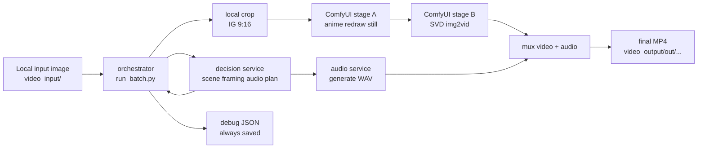

# Image-to-Video Local Pipeline

Local-only image-to-video pipeline (no AWS/S3/AMI/infra flow).

## Services

- `services/decision`:
  - Sends image + prompt to OpenAI and returns structured decision JSON:
    - scene (`tags`, `has_people`, `confidence`)
    - framing (`target_aspect`, `crop_anchor`)
    - video preset/fallbacks
    - audio prompt/mix
- `services/comfy`:
  - Runs ComfyUI and executes render workflows.
  - Uses workflow templates in `services/comfy/workflow_templates/`.
  - Outputs rendered media to `/data/outputs/comfy`.
  - Current pipeline for all presets is:
    - stage A: SD 1.5 anime redraw still
    - stage B: SVD img2vid from that anime still
- `services/audio`:
  - FastAPI service for audio generation.
  - Backends:
    - `audioldm` (model generation)
    - `mock` / `mock-fallback` (simple synthetic tone/noise fallback)
  - AudioLDM path generates multiple candidates, selects the best via RMS/clipping score,
    then applies ffmpeg post-processing (`loudnorm`, limiter, bass, stereo widen, reverb, fade).
  - Final output wav is post-processed to `48kHz` stereo.
  - Outputs wav files to `/data/outputs/audio`.
- `services/orchestrator`:
  - Main batch runner (`run_batch.py`).
  - Loads local images, calls decision service, crops input for IG 9:16,
    renders with Comfy, generates audio, muxes final mp4, writes `debug.json`.

## Flow



## Prerequisites

- Docker + Docker Compose plugin
- NVIDIA driver + Docker GPU runtime (for GPU render/audio)
- Local folders:
  - input images: `video_input/`
  - outputs: `video_output/`
  - models: `.local/models/`
  - render output/cache: `.local/outputs/`
  - audio cache: `.local/audio-cache/`

## Model Preparation

Create checkpoint folder:

```bash
mkdir -p "${MODEL_DIR:-$PWD/.local/models}/checkpoints"
```

Download required checkpoints:

```bash
curl -L "https://huggingface.co/stabilityai/stable-video-diffusion-img2vid-xt/resolve/main/svd_xt.safetensors?download=true" \
  -o "${MODEL_DIR:-$PWD/.local/models}/checkpoints/svd_xt.safetensors"

curl -L "https://huggingface.co/Comfy-Org/stable-diffusion-v1-5-archive/resolve/main/v1-5-pruned-emaonly-fp16.safetensors?download=true" \
  -o "${MODEL_DIR:-$PWD/.local/models}/checkpoints/v1-5-pruned-emaonly-fp16.safetensors"
```

Optional anime checkpoints used by preset defaults:

```bash
curl -L "https://huggingface.co/Xiero/Meinamix/resolve/e19075878a33073d3f5e6e16e19f82ab7056719f/meinamix_meinaV11.safetensors?download=true" \
  -o "${MODEL_DIR:-$PWD/.local/models}/checkpoints/meinamix_v11.safetensors"

curl -L "https://huggingface.co/gsdf/Counterfeit-V3.0/resolve/main/Counterfeit-V3.0_fp16.safetensors?download=true" \
  -o "${MODEL_DIR:-$PWD/.local/models}/checkpoints/counterfeit_v30.safetensors"

curl -L "https://huggingface.co/jackson885/anything-v5-PrtRE/resolve/main/anything-v5-PrtRE.safetensors?download=true" \
  -o "${MODEL_DIR:-$PWD/.local/models}/checkpoints/anything-v5-prt.safetensors"
```

Verify:

```bash
ls -lh "${MODEL_DIR:-$PWD/.local/models}/checkpoints"
```

Current model selection:

- All presets use the same two-stage pipeline:
  - stage A: SD 1.5 anime redraw
  - stage B: SVD video generation from the anime still
- Core video model: `svd_xt.safetensors`
- Core anime redraw fallback model: `v1-5-pruned-emaonly-fp16.safetensors`
- If available, anime redraw presets prefer:
  - `meinamix_v11.safetensors`
  - `counterfeit_v30.safetensors`
  - `anything-v5-prt.safetensors`

## Environment Variables

Set these in `.env`:

- `LOCAL_INPUT_DIR`: host path mounted to `/data/local_inputs`
- `LOCAL_OUTPUT_DIR`: host path mounted to `/data/local_outputs`
- `MODEL_DIR`: host path mounted to `/opt/ComfyUI/models`
- `OUTPUT_DIR`: host path mounted to `/data/outputs`
- `AUDIO_CACHE_DIR`: host path mounted to `/cache`
- `AUDIO_HOST_PORT`: local forwarded audio port (example `8001`)
- `OPENAI_API_KEY`: decision API key
- `OPENAI_MODEL`: decision model (example `gpt-5-mini`)
- `AUDIO_MODEL_BACKEND`: `audioldm` or `mock`
- `AUDIO_DEVICE`: `cuda` or `cpu`
- `AUDIO_INFERENCE_STEPS`: AudioLDM inference steps (default `60`)
- `AUDIO_GUIDANCE_SCALE`: AudioLDM guidance scale (default `3.5`)
- `AUDIO_NUM_SAMPLES`: candidates generated per prompt (default `3`)
- `AUDIO_SEED_BASE`: deterministic seed base (default `42`)
- `AUDIO_TARGET_LUFS`: loudness target for `loudnorm` (default `-14`)
- `AUDIO_TRUE_PEAK_DB`: true-peak ceiling in dB (default `-1.0`)
- `AUDIO_BASS_GAIN_DB`: bass enhancement gain (default `3`)
- `AUDIO_STEREO_MLEV`: stereo widening amount (default `0.03`)
- `AUDIO_REVERB_DELAY_MS`: reverb delay in ms (default `1000`)
- `AUDIO_REVERB_DECAY`: reverb decay (default `0.3`)
- `AUDIO_MUX_GAIN_DB`: gain added at final mux stage (default `3.0`)
- `AUDIO_MUX_TARGET_LUFS`: mux-stage loudnorm target (default `-12.0`)
- `AUDIO_MUX_TRUE_PEAK_DB`: mux-stage true peak ceiling (default `-1.0`)
- `COMFY_PROMPT_TIMEOUT_S`: max wait for one Comfy prompt before orchestrator fails (default `3600`)

Container runtime env is set in compose:
- `COMFY_URL=http://comfyui:8188`
- `AUDIO_URL=http://audio:8000`
- `INPUT_DIR=/data/inputs`
- `OUTPUT_DIR=/data/outputs`

## Start Stack

```bash
docker compose --env-file $(pwd)/.env \
  -f services/comfy/docker-compose.yml \
  -f services/comfy/docker-compose.gpu.yml \
  up -d --build
```

If models changed, restart Comfy:

```bash
docker compose --env-file $(pwd)/.env \
  -f services/comfy/docker-compose.yml \
  -f services/comfy/docker-compose.gpu.yml \
  restart comfyui
```

If `.env` changed for audio backend/device, recreate audio (restart is not enough):

```bash
docker compose --env-file $(pwd)/.env \
  -f services/comfy/docker-compose.yml \
  -f services/comfy/docker-compose.gpu.yml \
  up -d --force-recreate audio
```

## Run Batch

```bash
docker compose --env-file $(pwd)/.env \
  -f services/comfy/docker-compose.yml \
  -f services/comfy/docker-compose.gpu.yml \
  exec -T orchestrator python /app/services/orchestrator/run_batch.py \
  --job-id dry-001 \
  --input-prefix . \
  --output-prefix out \
  --local-input-dir /data/local_inputs \
  --local-output-dir /data/local_outputs
```

Run exactly one file:

```bash
docker compose --env-file $(pwd)/.env \
  -f services/comfy/docker-compose.yml \
  -f services/comfy/docker-compose.gpu.yml \
  exec -T orchestrator python /app/services/orchestrator/run_batch.py \
  --job-id dry-001 \
  --input-file _MG_6609.jpg \
  --output-prefix out \
  --local-input-dir /data/local_inputs \
  --local-output-dir /data/local_outputs
```

## Defaults

Applied automatically when no explicit override is provided:

```json
{"fps":5,"frames":25,"resolution_width":768,"steps":24,"motion_bucket_id":24}
```

`seed` is auto-generated per run unless you pass it explicitly.

Available video presets:
- `SVD_SUBTLE`
- `SVD_STRONG`
- `ANIMATEDIFF_GRASS_WIND`
- `ANIMATEDIFF_CITY_PULSE`
- `ANIMATEDIFF_LOW_MEM`
- `FAILSAFE_LOW_MEM`

Preset behavior:
- Every preset renders an anime still first, then runs SVD img2vid
- `SVD_SUBTLE`: gentlest anime redraw profile
- `SVD_STRONG`: stronger anime redraw profile
- `ANIMATEDIFF_GRASS_WIND`: outdoor/nature styling profile
- `ANIMATEDIFF_CITY_PULSE`: urban/night/reflections styling profile
- `ANIMATEDIFF_LOW_MEM`: simplified anime styling profile
- `FAILSAFE_LOW_MEM`: safest anime styling fallback
- Preset names act as styling profiles, not separate backend families

Override at runtime:

```bash
--video-params-json '{"fps":5,"frames":25,"resolution_width":768,"steps":24,"motion_bucket_id":24,"crop_anchor":"center_center"}'
```

When `--video-params-json` is provided, only the keys you pass are overridden. It does not merge with the default override block.

Add extra animation or styling directions at runtime:

```bash
--animation-directions "subtle hair movement, gentle camera drift, breeze through clothing"
```

You can also pass the same idea through JSON using either `anime_prompt_hint` or `animation_directions`.

Force simplified low-memory style profile:

```bash
--video-params-json '{"preset":"ANIMATEDIFF_LOW_MEM"}'
```

## Debug Mode

- `debug_YYYYMMDD_HHMMSS.json` is always saved.
- Intermediate artifacts are kept only with `--debug`.

Example:

```bash
docker compose --env-file $(pwd)/.env \
  -f services/comfy/docker-compose.yml \
  -f services/comfy/docker-compose.gpu.yml \
  exec -T orchestrator python /app/services/orchestrator/run_batch.py \
  --job-id dry-001 \
  --input-prefix . \
  --output-prefix out \
  --local-input-dir /data/local_inputs \
  --local-output-dir /data/local_outputs \
  --debug
```

## Outputs

- `video_output/out/<job-id>/<image-basename>/final_YYYYMMDD_HHMMSS.mp4`
- `video_output/out/<job-id>/<image-basename>/debug_YYYYMMDD_HHMMSS.json`

## Diagnostics

Comfy:

```bash
docker logs pipeline-comfyui --tail 120
```

Audio:

```bash
docker logs pipeline-audio --tail 120
docker exec pipeline-audio /bin/sh -lc 'env | grep ^AUDIO_'
```

Orchestrator:

```bash
docker logs pipeline-orchestrator --tail 120
```

## Stop

```bash
docker compose --env-file $(pwd)/.env \
  -f services/comfy/docker-compose.yml \
  -f services/comfy/docker-compose.gpu.yml \
  down
```

## License

This repository is licensed under the MIT License.
See [LICENSE](/home/mpshater/hobby/image2videoAWSIG/LICENSE) for details.
